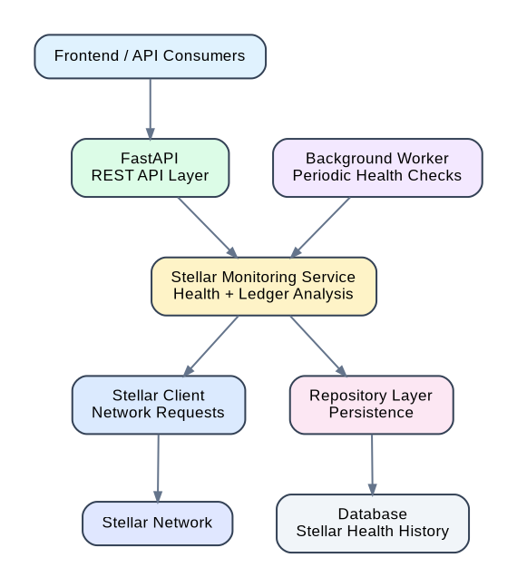

# 🌟 StellarWatch

### Open-Source Stellar Network Health Monitoring & Observability Platform

[](https://github.com/WideForgeLabs/stellarwatch)
[](https://www.python.org/)
[](https://fastapi.tiangolo.com/)
[](LICENSE)

StellarWatch is an open-source monitoring and observability platform focused on the **Stellar network and Soroban ecosystem**.

It continuously monitors Stellar network health, tracks ledger state, measures response time, stores historical health data, and exposes monitoring information through a REST API.

> **Mission:** Make Stellar infrastructure health visible, measurable, and easier to operate.

---

## 🚀 Why StellarWatch?

Stellar applications depend on reliable network infrastructure.

When infrastructure becomes slow, unavailable, or falls behind the network, applications can experience:

* Failed or delayed transactions
* Slow account and balance queries
* Stale network information
* Poor application performance
* Difficult-to-diagnose infrastructure failures
* Reduced reliability for payment applications

StellarWatch provides an observability layer for these problems.

Instead of manually checking network infrastructure, developers and infrastructure operators can continuously monitor Stellar health and review historical performance.

---

## 🎯 Project Goals

StellarWatch is being developed around four core goals:

1. **Monitor Stellar network health**
2. **Detect infrastructure problems quickly**
3. **Provide historical network-health data**
4. **Make Stellar infrastructure observability simple and accessible**

The current implementation establishes the core monitoring foundation. The roadmap expands this foundation into broader Stellar and Soroban infrastructure observability.

---

# ✨ Current Features

## 🌐 Stellar Network Monitoring

StellarWatch currently provides:

* Stellar network health checks
* Latest ledger monitoring
* Oldest ledger monitoring
* Ledger retention monitoring
* Network response-time measurement
* Healthy/unhealthy status detection
* Periodic background monitoring
* Historical health records
* REST API endpoints

A live health check returns data such as:

```json
{
  "status": "healthy",
  "latest_ledger": 4118963,
  "oldest_ledger": 3998004,
  "ledger_retention_window": 120960,
  "response_time_ms": 889.08
}
```

---

## 🏗️ Architecture



StellarWatch follows a modular architecture built around:

* FastAPI REST API
* Stellar monitoring services
* Stellar client/network integrations
* Background monitoring workers
* Repository and persistence layers
* Historical Stellar health records

The architecture is designed so that additional Stellar and Soroban monitoring capabilities can be added without tightly coupling them to the existing monitoring foundation.

---

## 🗺️ Roadmap

The current release establishes the core Stellar network monitoring foundation.

Planned improvements include:

* [ ] Stellar RPC endpoint monitoring
* [ ] Expanded Stellar network health metrics
* [ ] Historical health analytics
* [ ] Stellar infrastructure alerting
* [ ] Soroban RPC and smart-contract monitoring
* [ ] Monitoring dashboard
* [ ] Prometheus-compatible metrics

These improvements are tracked as GitHub issues and will be developed incrementally.

---

## 🧪 Development Status

The current implementation includes automated tests covering the monitoring and health-check functionality.

Run the test suite with:

```bash
python -m pytest -q
```

Current verification:

```text
6 passed
```

Code quality is checked with Ruff and Black:

```bash
ruff check .
black --check . --target-version py313
```

The current codebase passes both checks.

---

## 🔌 API

The current API exposes Stellar health information through endpoints including:

```text
GET /health
GET /api/v1/stellar/health
GET /api/v1/stellar/health/history
```

Example:

```bash
curl http://127.0.0.1:8000/api/v1/stellar/health
```

Example response:

```json
{
  "status": "healthy",
  "latest_ledger": 4118963,
  "oldest_ledger": 3998004,
  "ledger_retention_window": 120960,
  "response_time_ms": 889.08
}
```

Historical health data can be retrieved with:

```bash
curl http://127.0.0.1:8000/api/v1/stellar/health/history
```

---

## 🛠️ Technology Stack

### Backend

* Python 3.13+
* FastAPI
* SQLModel
* SQLAlchemy
* Pydantic
* Uvicorn

### Stellar Integration

* Stellar network health monitoring
* Stellar ledger information
* Network response-time measurement
* Stellar-specific monitoring services

### Development

* Pytest
* Ruff
* Black
* GitHub Actions

---

## 📁 Project Structure

```text
stellarwatch/
├── app/
│   ├── api/
│   ├── core/
│   ├── db/
│   ├── models/
│   ├── repositories/
│   ├── schemas/
│   ├── services/
│   ├── stellar/
│   └── workers/
├── tests/
├── docs/
│   ├── architecture.png
│   └── architecture.dot
├── CONTRIBUTING.md
├── LICENSE
├── README.md
└── requirements.txt
```

The codebase separates API handling, business logic, persistence, Stellar integrations, and background monitoring to keep the system modular and maintainable.

---

## 🤝 Contributing

Contributions are welcome.

See [CONTRIBUTING.md](CONTRIBUTING.md) for development guidelines and the project workflow.

The GitHub issue tracker contains the current StellarWatch roadmap and planned improvements.

---

## 📌 Project Status

StellarWatch is an actively developing open-source project.

The current implementation focuses on establishing a reliable foundation for Stellar network health monitoring. Future work will extend this foundation toward deeper Stellar RPC, Soroban, alerting, analytics, dashboard, and metrics capabilities.

---

## 📄 License

StellarWatch is released under the MIT License. See [LICENSE](LICENSE) for details.
